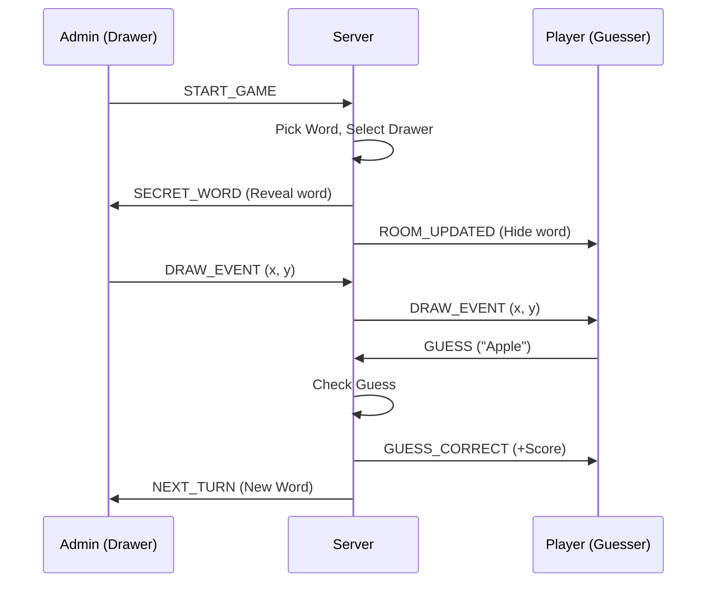

# Comprehensive Guide: Building a Real-Time Drawing Game (Scribble)

This guide provides a professional approach to architecting and implementing a real-time multiuser drawing and guessing game, commonly known as "Scribble." 

---

## 1. Architectural Philosophy: Separation of Concerns

The most critical mistake in real-time game development is creating a "God Object" (a single massive class) that handles everything. Instead, use a **Manager-based architecture**.

### Why Modularity Matters?
- **Testability**: You can test the `ScoreManager` without starting a websocket server.
- **Maintainability**: If the drawing logic needs to change from 2D coordinates to paths, you only touch `DrawManager`.
- **Readability**: Small, focused files are easier for new developers (or AI) to understand.

---

## 2. Backend Architecture: The Engine

The backend should act as the "Source of Truth." It manages rooms, enforces rules, and synchronizes state.

### A. Modular Manager Pattern
Break your game logic into specialized managers:
1. **UserManager**: Tracks socket IDs, user IDs, names, and "Admin" status.
2. **DrawManager**: Buffers canvas events to sync late-joiners.
3. **ChatManager**: Processes messages and checks guesses against the secret word.
4. **ScoreManager**: Logic for awarding points (e.g., faster guesses get more points).
5. **RoomManager**: Orchestrates the game loop (Start Game -> Start Turn -> End Game).

### B. Real-Time Communication
Use **Socket.IO** or **WebSockets** (WS). 
- **Namespaces/Rooms**: Use the built-in room functionality to isolate message broadcasts.
- **Payload Structure**: Always use a consistent JSON format:
  ```json
  { "type": "DRAW_EVENT", "payload": { "x": 10, "y": 20 } }
  ```

---

## 3. Frontend Architecture: The Interface

The frontend should be a "Dumb Renderer" that responds to server events.

### A. The Canvas Service
Don't just draw on a `<canvas>` element. Create a wrapper:
- **Input Handling**: Capture mouse/touch events and emit them to the server.
- **Rendering**: Listens for `DRAW_EVENT` from the server and paints on the local canvas.
- **Local Echo (Predictive Drawing)**: Draw immediately for the local user to avoid latency lag, but sync with the server version.

### B. State Management
Use a store (Redux, Zustand, or Vuex) to keep track of:
- `gameStarted`: Should the Start button be visible?
- `isDrawer`: Should the drawing tools be enabled?
- `timeLeft`: Syncing the countdown timer from the server.

---

## 4. The Core Game Loop



---

## 5. Development Roadmap: Step-by-Step

### Phase 1: MVP (Minimum Viable Product)
1. Set up a basic Express + Socket.IO server.
2. Implement Room joining/leaving.
3. Create a shared Canvas where anyone can draw and everyone sees it.

### Phase 2: Game Logic
1. Implement the "Admin" role (first user in room).
2. Create the "Start Game" trigger.
3. Add a timer and turn switching.

### Phase 3: Scoring & Chat
1. Implement the Guessing system.
2. Add a Scoreboard.
3. Filter the "Secret Word" from the drawer's chat but show it to others once guessed.

### Phase 4: Polish & Performance
1. **Throttling**: Don't send 60 draw events per second; 20-30 is usually enough.
2. **Persistence**: Handle tab refreshes by syncing `GameState` on `JOIN_ROOM`.
3. **UX**: Add "Drawing Tools" (Colors, Brush size).

---

## 6. Pro-Tips for Success

> [!TIP]
> **Static Typing**: Use TypeScript for both Backend and Frontend. Share a `types.ts` file between them so your event names and payloads are always in sync.

> [!WARNING]
> **Security**: Never trust the client. The backend must verify if the user sending a `DRAW_EVENT` is actually the assigned drawer for that turn.

> [!IMPORTANT]
> **Latency**: Real-time games live or die by latency. Use binary formats if your data gets heavy, but for a Scribble game, optimized JSON is perfect.
